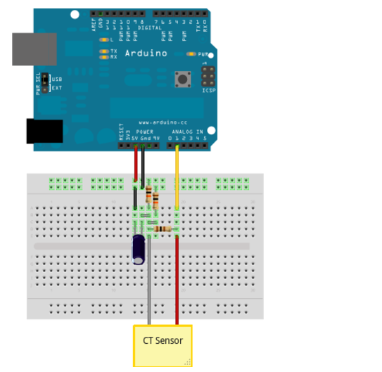

# Envio de dados do sensor de corrente para a nuvem

## Introdução
O procedimento a seguir refere-se ao projeto para monitoramento de energia com plataformas de desenvolvimento abertas usando também o conceito de IoT (Internet of Things) ao fazer uso de Arduino, Raspberry Pi e envio de dados para a nuvem.

## Hardware
O Hardware utilizado constitui-se de tecnologias Open Source e dos componentes eletrônicos listados a seguir:

* Arduino Uno
* Raspberry Pi 3 Model B
* 2 resistores de 10KΩ (para o divisor de tensão)
* 1 resistor de 33Ω (para o resistor de carga)
* 1 capacitor de 10µF
* Sensor Sct-013 de 100 A

E seguem a montagem ilustrada abaixo:



## Integração Arduino e Raspberry
A integração entre Arduino e Raspberry Pi é feita com comunicação serial. Isso é feito ao conectar o cabo USB do Arduino a uma das portas do Raspberry Pi (no caso foi usado a primeira).

Antes da conexão, no prompt de comando do Raspberry digite o seguinte:
```ls /dev/tty* ```

Depois conecte o cabo e novamente digite o codigo. Será acrescentado uma porta na lista que é a porta em que o Arduino esta conectado (normalmente "/dev/ttyACM0").

Istale a biblioteca Pyserial

## Software Arduino
O software do Arduino é basicamente usar a biblioteca Emonlib disponibilizada aqui ["Download_Emonlib"](https://github.com/openenergymonitor/EmonLib) e uma linha de código que contenha algumas características do sensor (como a porta em que está conectado ao Arduino e parâmetros de calibração) e os comandos para printar os dados na porta serial.

## Software Raspberry
O software no Raspberry é escrito em linguagem Python e utiliza protocolo MQTT para envio de mensagens e MongoDb para o banco de dados local. Então é necessário o download das bibliotecas desses sistemas.

* Biblioteca paho-mqtt
``` pip install paho-mqtt ```
* Biblioteca pymongo
``` pip install pymongo ```

Os dados são enviados para o brocker MQTT em formato json islustrado abaixo:
```
doc = {
    "user": "yasmin",
  "local": "labic",
  "device": "raspberry pi",
  "hour": hora,
  "day": data,
  "type_sensor": "corrente",
  "model_sensor": "SCT-013",
  "value": value }
  ```
